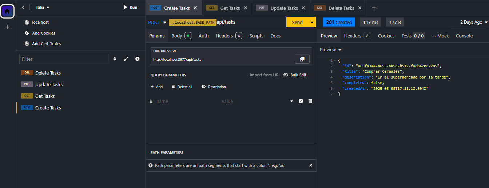
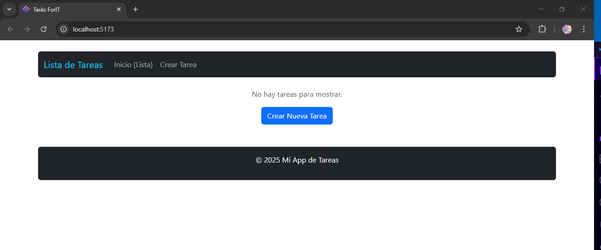
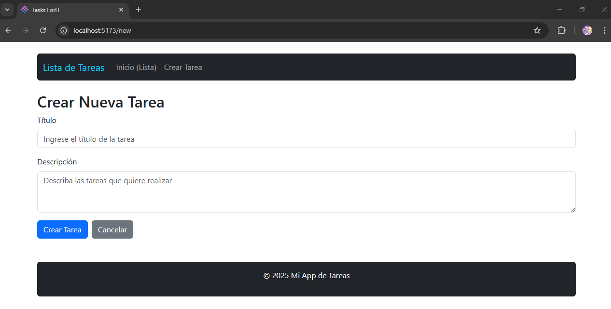
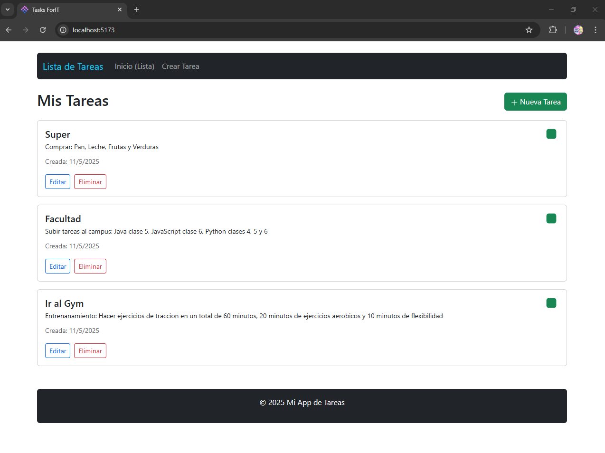
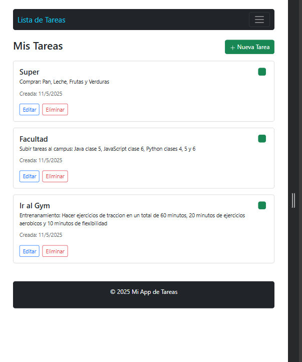

# ForIT Challenge - ToDo List

Aplicación de lista de tareas desarrollada como parte del challenge de ingreso a la Academia ForIT 2025.

## Clonación del repositorio

```bash
git clone https://github.com/tu-usuario/Tasks-ForIT.git
cd Tasks-ForIT
```

## Instalación de dependencias

```bash
npm install
```

## Ejecución del backend

```bash
npm run dev
```

## Ejecución del frontend

```bash
npm run dev
```

## Backend descripcion

El backend de Tasks-ForIT está desarrollado para gestionar tareas. Permite crear, leer, actualizar y eliminar tareas (operaciones CRUD) mediante endpoints HTTP.

## Estructura del backend

```bash
backend/
├── controllers/     # Maneja la lógica de cada endpoint
│   └── tasksControllers.js
├── data/           # Gestiona el almacenamiento de datos
│   └── data.js
├── routes/         # Define las rutas de la API
├── server.js       # Punto de entrada de la aplicación

```

## Endpoints de la API

```bash
GET /tasks            # Obtener todas las tareas
GET /tasks/:id        # Obtener una tarea por ID
POST /tasks           # Crear una nueva tarea
PUT /tasks/:id       # Actualizar una tarea por ID
DELETE /tasks/:id    # Eliminar una tarea por ID
```

## Ejemplo de uso del backend en insomnia

```bash
# Obtener todas las tareas
GET http://localhost:3000/tasks

# Obtener una tarea por ID
GET http://localhost:3000/tasks/1

# Crear una nueva tarea
POST http://localhost:3000/tasks
Content-Type: application/json

{
  "title": "Nueva tarea",
  "description": "Descripción de la tarea"
}

# Actualizar una tarea
PUT http://localhost:3000/tasks/1
Content-Type: application/json

{
  "title": "Tarea actualizada",
  "description": "Descripción actualizada"
}

# Eliminar una tarea
DELETE http://localhost:3000/tasks/1
```

## Imagenes de ejemplo en Insomnia



## Frontend descripcion

El frontend de Tasks-ForIT es una aplicación web desarrollada con React y Vite. Permite a los usuarios interactuar con la API de tareas, mostrando una lista de tareas y permitiendo la creación, actualización y eliminación de tareas.

## Estructura del frontend

```bash

frontend/
├── src/
│   ├── components/       # Componentes de React
│   │   ├── TaskForm.jsx  # Formulario para crear/editar tareas
│   │   ├── TaskList.jsx  # Lista de tareas con funcionalidades
│   │   └── TaskItem.jsx  # Componente individual de tarea
│   ├── App.jsx          # Componente principal y rutas
│   └── main.jsx         # Punto de entrada de la aplicación

```

## Rutas del frontend

```bash
Ruta	Componente	Descripción

-/	TaskList	# Lista de todas las tareas

-/new	TaskForm	# Formulario para crear una nueva tarea

-/edit/:taskId	TaskForm	# Formulario para editar una tarea existente
```

## Ejemplo de uso del frontend con el siguiente flujo

1. El usuario accede a la ruta `/` y ve una lista de tareas.
2. El usuario puede crear una nueva tarea accediendo a la ruta `/new`.
3. El usuario puede editar una tarea existente accediendo a la ruta `/edit/:taskId`.
4. El usuario puede eliminar una tarea desde la lista de tareas.

## Video de ejemplo del frontend

[Ver demo del frontend (video mp4)](./assets/demo.mp4)

## Imagenes de ejemplo del frontend







### Vista Mobile



## Tecnologías

- Backend: Node.js, Express
- Frontend: React, Vite
- Control de versiones: Git
- UUID: Generación de identificadores únicos
- Insomnia: Para pruebas de API
- dotenv: Gestión de variables de entorno
- nodemon: Herramienta para reiniciar automáticamente el servidor durante el desarrollo
- cors: Middleware para habilitar CORS
- Bootstrap: Framework CSS para diseño responsivo
- React Router: Para la navegación en el frontend
